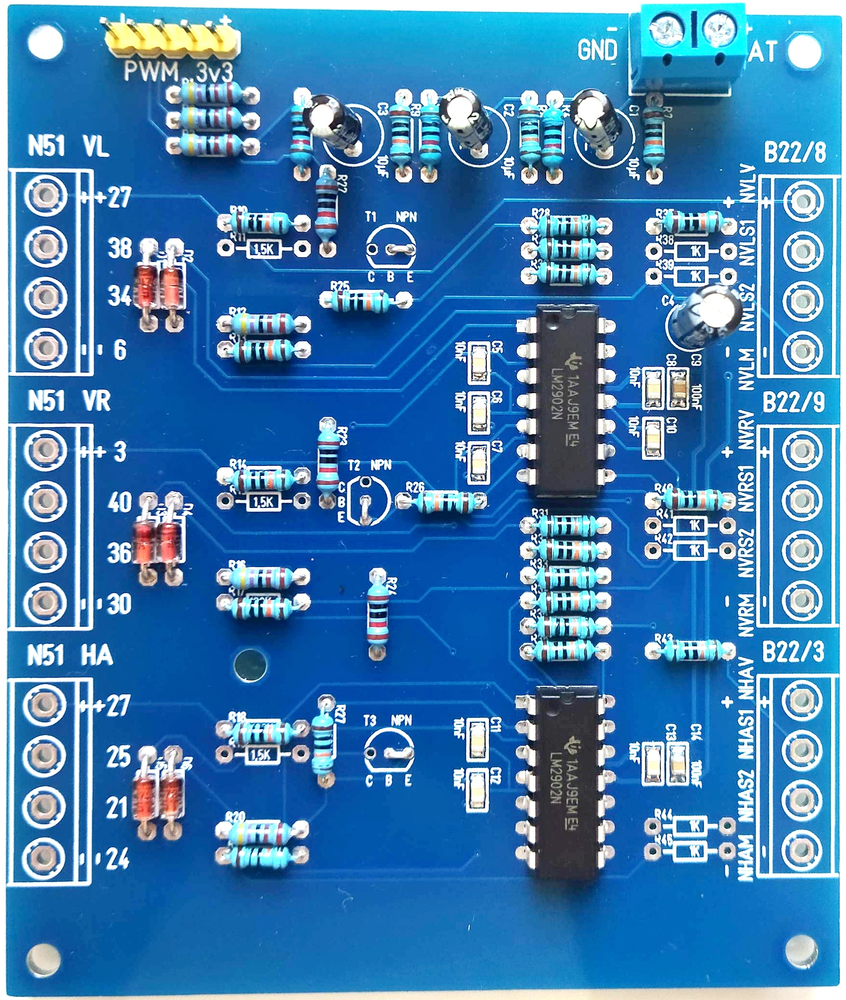
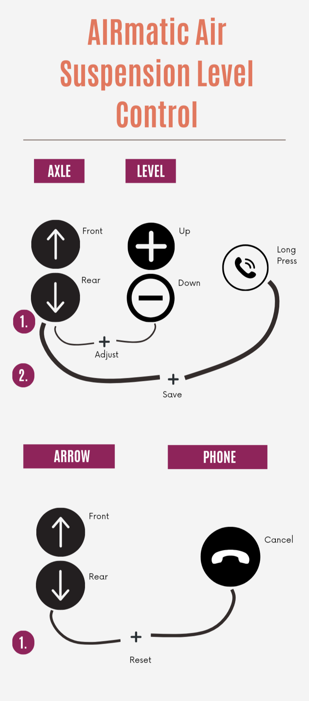

# AIRmatic Air Suspension Level Control DIY Kit

**Description**  
This project provides a DIY electronics kit for Mercedes-Benz vehicles equipped with the **AIRmatic** air suspension system.  
It enables the individual adjustment of suspension level by manipulating the level sensor signals (0.5V – 4.5V range) by up to ±1V.  
Separate level settings can be configured for different driving modes (Comfort, Sport, Sport 2).

---

**Disclaimer**  
This project is published solely as an informational DIY guide for private, non-commercial use.  
No products, kits, or components are sold, supplied, or placed on the market.  
The author does not act as a manufacturer, distributor, or operator placing products on the market under applicable product safety laws (such as EU Product Safety Directive or national laws).  
Use at your own risk. No warranty is provided.

**This modification is intended for motorsport or off-road use only and is not approved for use on public roads.**

Installing this modification may **invalidate your vehicle's operating license and type approval**, and may be subject to local laws and regulations.

**The user assumes full responsibility for any legal consequences, including but not limited to liability for safety, damages, and compliance with regulations.**

---

**License**  
This project is licensed under the MIT License.  
See the [LICENSE](LICENSE) file for full details.

This project includes third-party libraries licensed under the **LGPL-2.1** license.  
In accordance with the LGPL-2.1 license terms, please always provide full source code with every binary released.

---

**Credits**

- **Concept and development**  
  Project Author: [aIecxs](https://github.com/aIecxs)  

- **MCP2515 Arduino Library**  
  Library for SPI communication with MCP2515 CAN controllers.  
  [autowp/arduino-mcp2515](https://github.com/autowp/arduino-mcp2515)

- **Mercedes-Benz CAN Bus Research**  
  CAN bus reverse engineering by @rnd-ash.  
  [rnd-ash/mercedes-hacking-docs](https://github.com/rnd-ash/mercedes-hacking-docs/blob/master/Chapter%207%20In%20Car%20Entertainment.md)
  
- **ArduinoJson**  
  Efficient JSON serialization library for embedded systems  
  [bblanchon/ArduinoJson](https://github.com/bblanchon/ArduinoJson)  

- **ElegantOTA**  
  Library for web-based OTA firmware and filesystem updates  
  [ayushsharma82/ElegantOTA](https://github.com/ayushsharma82/ElegantOTA)  

- **ESPAsyncWebServer**  
  Asynchronous web server for ESP32  
  [ESPAsync/ESPAsyncWebServer](https://github.com/ESP32Async/ESPAsyncWebServer)  

- **AsyncTCP**  
  Asynchronous TCP library for ESP32 (dependency of ESPAsyncWebServer)  
  [ESPAsync/AsyncTCP](https://github.com/ESP32Async/AsyncTCP)  

  ---
  
**`⚠️ UNDER DEVELOPMENT – CODE BASE FOR PERSONAL ARCHIVING ONLY ⚠️`**

  **Offset Voltage**

| PWM  | Res | Duty | mm  | Offset Voltage (V) |
|------|-----|------|-----|--------------------|
| 0%   | 255 | 0    | -50 | -1.0               |
| 5%   | 255 | 11   | -45 | -0.9               |
| 9%   | 255 | 23   | -40 | -0.8               |
| 14%  | 255 | 34   | -35 | -0.7               |
| 18%  | 255 | 46   | -30 | -0.6               |
| 23%  | 255 | 57   | -25 | -0.5               |
| 27%  | 255 | 69   | -20 | -0.4               |
| 32%  | 255 | 80   | -15 | -0.3               |
| 36%  | 255 | 92   | -10 | -0.2               |
| 41%  | 255 | 103  | -5  | -0.1               |
| 45%  | 255 | 115  | 0   | 0.0                |
| 50%  | 255 | 126  | 5   | 0.1                |
| 54%  | 255 | 138  | 10  | 0.2                |
| 59%  | 255 | 149  | 15  | 0.3                |
| 63%  | 255 | 161  | 20  | 0.4                |
| 68%  | 255 | 172  | 25  | 0.5                |
| 72%  | 255 | 184  | 30  | 0.6                |
| 77%  | 255 | 195  | 35  | 0.7                |
| 81%  | 255 | 207  | 40  | 0.8                |
| 86%  | 255 | 218  | 45  | 0.9                |
| 90%  | 255 | 230  | 50  | 1.0                |

---

### AIRmatic - NHRS2 only until 05/2005 or AMG models

#### Front Left Level Sensor (B22/8 -> N51)

| Pin | Signal | Pin    | Color | Description |
|-----|--------|--------|--------|-------------|
| 1   | NVLM   | 6      | GYVT (grey-violet) | Ground front left level sensor |
| 5   | NVLV   | 27     | BNWH (brown-white) | Supply front left level sensor |
| 4   | NVLS1  | 38     | GNRD (green-red)   | Signal 1 front left level sensor |
| 6   | NVLS2  | 34     | BKBU (black-blue)  | Signal 2 front left level sensor *(optional)* |

#### Front Right Level Sensor (B22/9 -> N51)

| Pin | Signal | Pin    | Color | Description |
|-----|--------|--------|--------|-------------|
| 1   | NVRM   | 30     | BNBK (brown-black) | Ground front right level sensor |
| 5   | NVRV   | 3      | WHBU (white-blue)  | Supply front right level sensor |
| 4   | NVRS1  | 40     | BKYE (black-yellow)| Signal 1 front right level sensor |
| 6   | NVRS2  | 36     | BNRD (brown-red)   | Signal 2 front right level sensor *(optional)* |

#### Rear Axle Level Sensor (B22/3 -> N51)

| Pin | Signal | Pin    | Color | Description |
|-----|--------|--------|--------|-------------|
| 1   | NHRM   | 24     | BNWH (brown-white) | Ground rear axle level sensor |
| 5   | NHRV   | 27     | BUWH (blue-white)  | Supply rear axle level sensor |
| 4   | NHRS1  | 25     | BNGY (brown-grey)  | Signal 1 rear axle level sensor |
| 6   | NHRS2  | 21     | YEBK (yellow-black)| Signal 2 rear axle level sensor *(optional)* |

---

### ENR Variant (Swapped NHRS1 / NHRV?) - B22/3 -> N97

| Pin | Signal | Pin    | Color | Description |
|-----|--------|--------|--------|-------------|
| 1   | NHRM   | 2      | BNGY (brown-grey)  | Ground rear axle level sensor |
| 4   | NHRV   | 13     | BUWH (blue-white)  | Supply rear axle level sensor *(swapped?)* |
| 5   | NHRS1  | 12     | BNWH (brown-white) | Signal 1 rear axle level sensor *(swapped?)* |
| 6   | NHRS2  | 3      | YEBK (yellow-black)| Signal 2 rear axle level sensor |

---

### Color Code Reference

| Code | Color (EN) | Farbe (DE)     |
|------|------------|----------------|
| BK   | Black      | Schwarz        |
| BN   | Brown      | Braun          |
| BU   | Blue       | Blau           |
| GN   | Green      | Grün           |
| GY   | Grey       | Grau           |
| PK   | Pink       | Rosa           |
| RD   | Red        | Rot            |
| TR   | Transparent| Transparent    |
| VT   | Violet     | Violett        |
| WH   | White      | Weiß           |
| YE   | Yellow     | Gelb           |

---

### Signal Prefix Key

| Prefix | Meaning                    |
|--------|----------------------------|
| N      | Level Sensor (Niveausensor) |
| V      | Front (Vorne)              |
| HR     | Rear Axle (Hinterachse)    |
| L      | Left (Links)               |
| R      | Right (Rechts)             |
| M      | Ground (Masse)             |
| V      | Supply (Versorgung)        |
| S1     | Signal 1                   |
| S2     | Signal 2                   |

---

### PCB Design

The printed circuit board (PCB) layout for this project was created using the **Maker Edition of TARGET 3001!** generously provided for non-commercial DIY use.

With kind permission of **IBF Electronic** – www.target3001.com

Download full schematic and PCB [LM2902N.T3001](XGerber.zip)

This license allows free usage exclusively for personal, non-commercial projects. Redistribution or commercial use of the PCB layout created with this software may require a separate license.

---

## Installation

To compile and upload the firmware to your ESP32, follow these steps:

 1. **Arduino IDE 2.x**  
    Install the [Arduino IDE](https://www.arduino.cc/en/software)

 2. **ESP32 Board Support**  
    Make sure you have installed the [ESP32 board package](https://randomnerdtutorials.com/esp32-pinout-reference-gpios) by Espressif Systems  
    [esp32 by Espressif Systems](https://github.com/espressif/arduino-esp32)

 3. **LittleFS support**  
    For file system operations (e.g. storing presets) install the [ESP32 LittleFS tool for Arduino IDE 2.x](https://randomnerdtutorials.com/arduino-ide-2-install-esp32-littlefs) Add-on

 4. **MCP2515 CAN Library**  
    Install the library via **Arduino Library Manager**: search for `autowp-mcp2515`  
    [https://github.com/autowp/arduino-mcp2515](https://github.com/autowp/arduino-mcp2515)

 5. **ArduinoJson Library**  
    Install the library via **Arduino Library Manager**: search for `ArduinoJson`  
    [https://github.com/bblanchon/ArduinoJson](https://github.com/bblanchon/ArduinoJson)

 6. **ElegantOTA Library**  
    Install the library via **Arduino Library Manager**: search for `ElegantOTA`  
    [https://github.com/ayushsharma82/ElegantOTA](https://github.com/ayushsharma82/ElegantOTA)  
    next open `%UserProfile%/Documents/Arduino/libraries/ElegantOTA/src/ElegantOTA.h` with Editor,  
    modify the line: `#define ELEGANTOTA_USE_ASYNC_WEBSERVER 1` -> change 0 to 1

 7. **ESPAsyncWebServer Library**  
    Install the library via **Arduino Library Manager**: search for `ESP Async WebServer` by ESP32Async  
    [https://github.com/ESP32Async/ESPAsyncWebServer](https://github.com/ESP32Async/ESPAsyncWebServer)

 8. **AsyncTCP Library**  
    Install the library via **Arduino Library Manager**: search for `Async TCP` by ESP32Async  
    [https://github.com/ESP32Async/AsyncTCP](https://github.com/ESP32Async/AsyncTCP)

 9. **FakeCH340 Driver (optional)**  
    If you encounter serial driver conflicts under Windows, you may need to install FakeCH340 drivers.  
    [FakeCH340DriverFixer by SHWotever](https://github.com/SHWotever/FakeCH340DriverFixer)

10. **Download and Extract the firmware**  
    download and extract [w211-airmatic-master.zip](https://codeload.github.com/aIecxs/w211-airmatic/zip/refs/heads/master)  
    create new directory `%UserProfile%/Documents/Arduino/` `AIRmatic` and copy files
    - data/\*.\*  
    - AIRmatic.ino  
    - CAN.ino  
    - Wireless.ino  
    - w211_can_c.h  
    - w211_can_b.h  

12. **Compile and Upload the firmware** (USB)  
    connect the ESP32 DevKit to Computer, open the Arduino Sketch, select the Board  
    Tools -> Board -> esp32 -> ESP32 Dev Module  
    click Upload Icon, press the BOOT button on ESP32 DevKit to enter flashing mode  
    press `[Ctrl]` + `[Shift]` + `[P]`, then type > `"Upload LittleFS to Pico/ESP8266/ESP32"`  
    (refer to guide [**3. LittleFS support**](README.md#installation) screenshot 4.)

14. **Update the firmware** (WiFi)  
    connect Computer to ESP32 WiFi (see [Wireless.ino](Wireless.ino#L24) for credentials)  
    visit http://192.168.4.1/update  
    upload the [AIRmatic.ino.bin](https://github.com/aIecxs/w211-airmatic/releases/download/v0.0.1/AIRmatic.ino.bin) (or see in `%Temp%/arduino/sketches`)  
    select LittleFS, upload the [AIRmatic.littlefs.bin](https://github.com/aIecxs/w211-airmatic/releases/download/v0.0.1/AIRmatic.littlefs.bin) (or see in `%Temp%` -> `tmp*.littlefs.bin`)

---

## Wiring

- **Power Supply:**  
  Use a DC-DC buck converter (12V -> 5V) to supply power to the microcontroller (MCU).

- **Connect PCB to control unit:**  
  Wire battery voltage, ground, and the level sensor signal lines between the PCB and the vehicle's air suspension ECU.
  For a visual guide on wiring, refer to the following video:  
  [Wiring Overview Video](https://www.youtube.com/watch?v=JCMEg7JYTig)

- **Connect MCU to CAN bus module:**  
  Use the SPI interface (MOSI, MISO, SCK, CS, INT) to communicate with the MCP2515 CAN module.

- **Connect MCU to PCB:**  
  Link the MCU PWM output pins to the PCB for analog signal offset control. (refer to [AIRmatic.ino](AIRmatic.ino#L28) for pins)

---

## Usage

- Start engine  
- Put Instrument Cluster in Phone mode  
- Select AIRmatic mode from center console  
- Use the Steering wheel buttons to adjust offset (5mm steps)  
- Save Settings with long press  

**Wireless Usage**

- connect to ESP32 WiFi  
- visit info page -> http://192.168.4.1/config

(within 5 minutes of start)